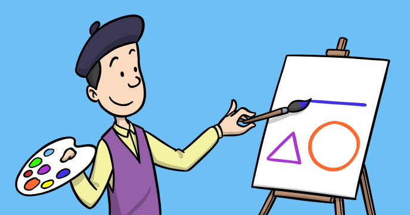

Artist is a drawing program with a twist: it generates the source code of the drawing that the user makes! 

With Artist you can visually add colored shapes on the screen and when done, at a click of a button you’ll get the source code. And since this is valid JavaScript source code, you can copy and paste it in a new code window so you can persist and share your drawing as code!

By coding Artist, you’ll learn important concepts such as:

-	How to implement UI elements from scratch
-	How to implement an Undo/ Redo mechanism
-	How to generate code automatically
 
## Source code 
The JavaScript source code of this program can be found [here](sketches/program.js). To run it, you need to import it in the [codeguppy.com](https://codeguppy.com) online editor. Alternatively, you can use the source code in your p5.js sketches (advanced use). 
## Online version 
To see the code running, check the online playground at [https://codeguppy.com/code.html?t=artist](https://codeguppy.com/code.html?t=artist) 
## Next steps 
Please check [codeguppy.com](https://codeguppy.com) for many other fun JavaScript programs and games for beginners. To stay up to date with CodeGuppy development please follow [@codeguppy](https://twitter.com/codeguppy) on Twitter.  
